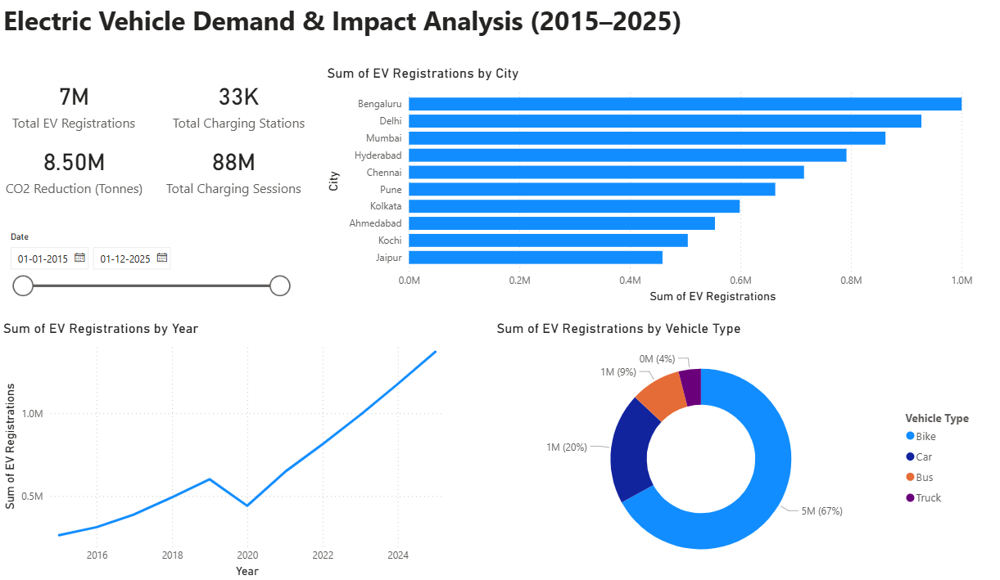

# 🚗 Electric Vehicle Demand & Impact Analysis (2015–2025)

This project analyzes the growth of **Electric Vehicle (EV) adoption in major Indian cities** using **Microsoft Power BI**.  
The dashboard highlights EV registrations, charging infrastructure growth, charging sessions, and environmental impact over time

---

## 📊 Dashboard Preview

---

## 📊 Key Insights
✔ EV registrations increased significantly from **2015 to 2025**.  
✔ **Bengaluru, Delhi, and Mumbai** lead EV adoption among major cities.  
✔ **Two-wheelers dominate EV registrations** in India.  
✔ A noticeable drop in EV registrations occurred in **2020 due to the COVID-19 lockdown**.  
✔ Charging infrastructure and charging sessions increased alongside EV adoption.

---

## 🛠 Tools Used

- Microsoft Power BI  
- Microsoft Excel  
- Data Analytics & Visualization  

---

## 📁 Project Files

| File | Description |
|-----|-------------|
| `EV_Dashboard.pbix` | Power BI dashboard |
| `EV_Demand_Impact_Dataset_2015_2025.xlsx` | Dataset used for analysis |
| `EV_Project_Presentation.pptx` | Final project presentation |

---

## 📈 Dashboard Overview

The Power BI dashboard provides insights into:

- EV registrations by **city**
- EV registrations by **vehicle type**
- EV adoption trends **(2015–2025)**
- Growth in **charging stations**
- **CO₂ emission reduction impact**

---

## 🔗 GitHub Repository

Project Repository:  
https://github.com/krit-k7/EV-Demand-Impact-Analysis
